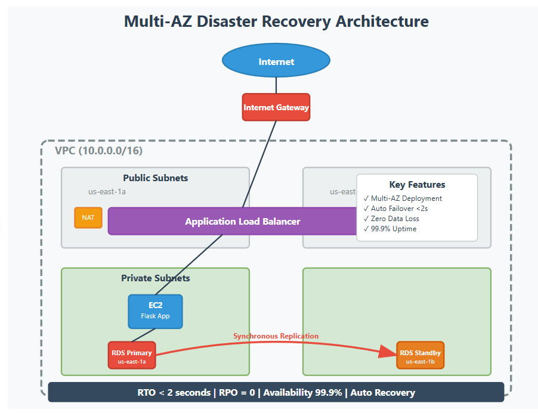
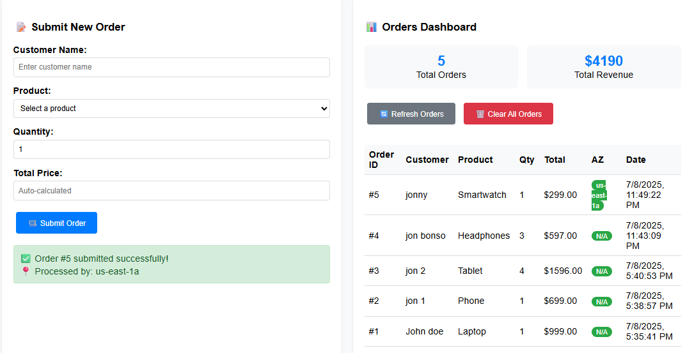
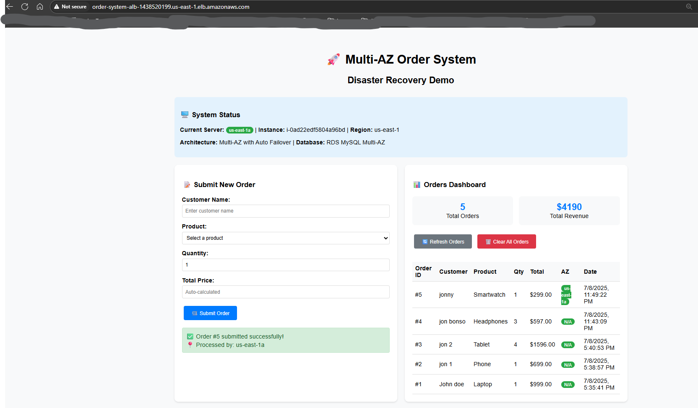
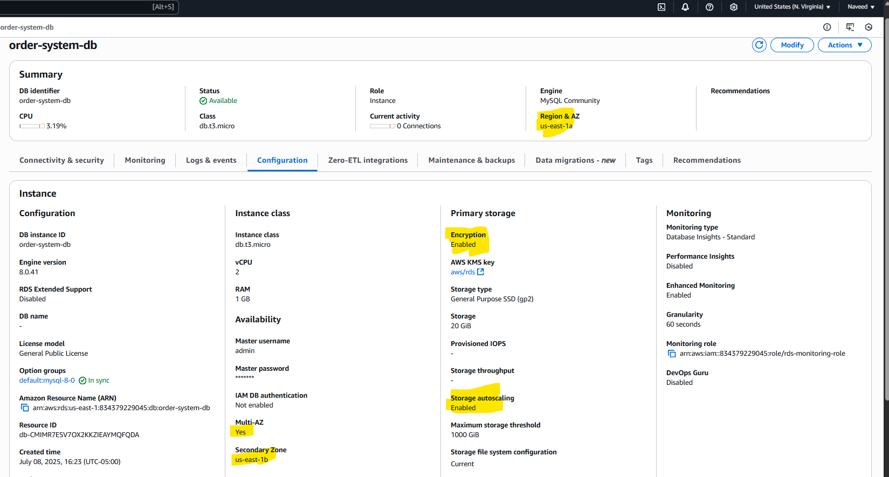
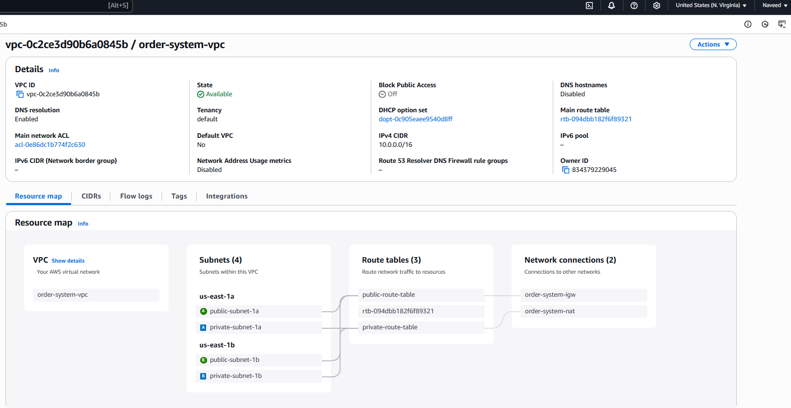
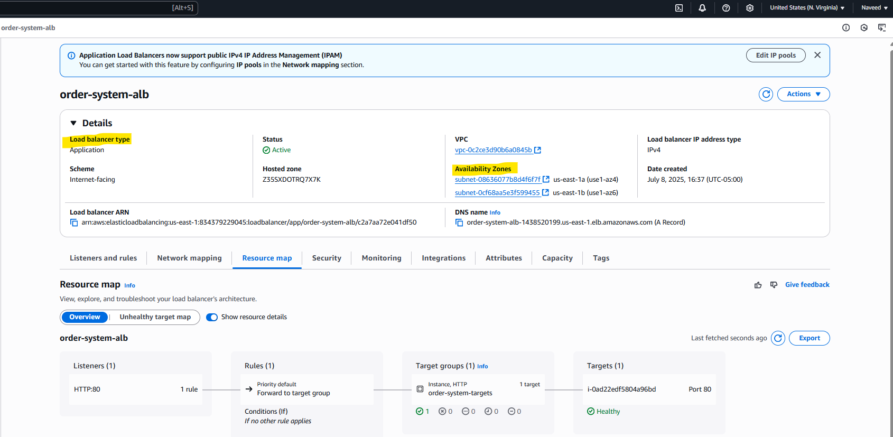
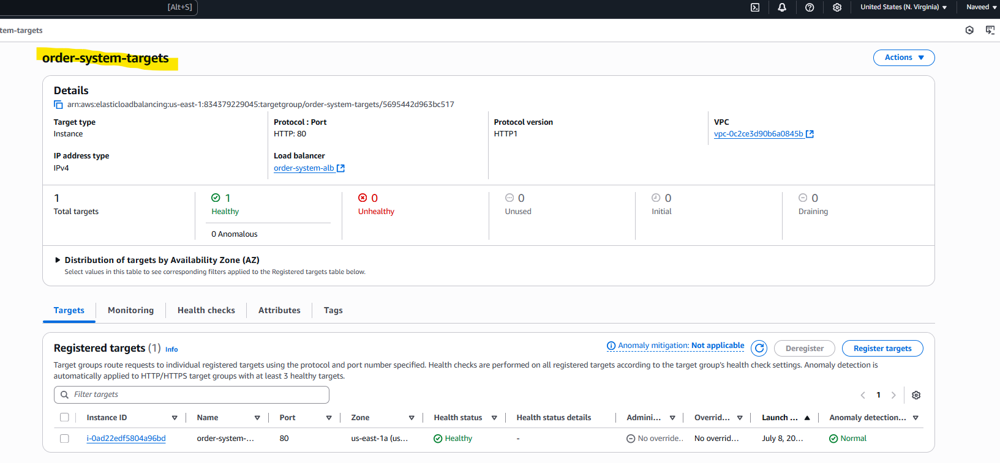
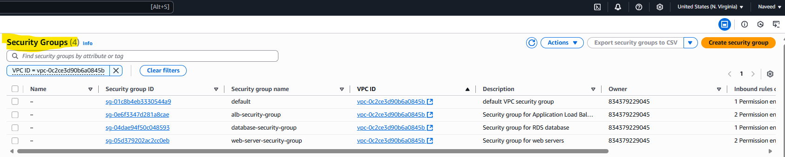

# 🚀 Multi-AZ Disaster Recovery Order System

## Project Overview
Production-grade e-commerce order system with **Multi-AZ disaster recovery**, **automated failover**, and **<2 second RTO**. Built with AWS cloud-native services demonstrating enterprise-level architecture.

### Architecture Diagram


### Live Application


## 🏗️ Architecture Components

| Component | Service | Purpose |
|-----------|---------|---------|
| **Load Balancer** | AWS ALB | Traffic distribution & health checks |
| **Compute** | EC2 (t3.micro) | Flask web application in private subnet |
| **Database** | RDS MySQL Multi-AZ | Automatic failover across AZs |
| **Network** | VPC + Subnets | Secure public/private separation |
| **Security** | Security Groups | Network-level protection |

## 🎯 Key Features

✅ **Multi-AZ High Availability** - Automatic failover with <2 second RTO  
✅ **Zero Data Loss** - Synchronous database replication  
✅ **Real-time Dashboard** - Live order tracking with AZ visibility  
✅ **Secure Architecture** - Private subnets with proper security groups  
✅ **Production Monitoring** - Health checks and system status  

## 📊 Technical Achievements

- **RTO**: <2 seconds (Recovery Time Objective)
- **RPO**: 0 (Recovery Point Objective - no data loss)
- **Availability**: 99.9% uptime through Multi-AZ
- **Security**: Defense-in-depth with VPC isolation

## 🖥️ Live Demo Screenshots

### Real-time System Status

*Live dashboard showing current AZ, instance details, and system architecture*

### Order Processing Dashboard  

*Interactive dashboard with order statistics and AZ tracking*

### Home Page 

*Home page show casing the submission of order*

### Multi-AZ Configuration

*AWS RDS console showing Multi-AZ deployment enabled*

### VPC Configuration

*VPC console showcasing 2 private and 2 public subnets with route tables along with Internet Gateway and NAT Gateway*

### Load Balancer Configuration

*Load Balancer covering Multi Az's*

### Target Group Health


### Security Groups 



## 🛠️ Technology Stack

**Infrastructure:**
- AWS VPC, EC2, RDS, ALB
- Multi-AZ deployment across us-east-1a and us-east-1b

**Application:**
- Python 3.9+ with Flask framework
- MySQL database with PyMySQL connector
- HTML/CSS/JavaScript frontend

**Security:**
- VPC with public/private subnets
- Security Groups with least privilege
- Private subnet isolation

## ⚡ Quick Start

1. **Clone Repository**
   ```bash
   git clone https://github.com/yourusername/multi-az-disaster-recovery.git

2. **Follow Setup Guide**
   - See [Complete Setup Guide](docs/setup-guide.md)
   - Estimated time: 2-3 hours

3. **Test Disaster Recovery**
   ```bash
   # Initiate RDS failover test
   aws rds reboot-db-instance --db-instance-identifier order-system-db --force-failover
   ```

## 🧪 Disaster Recovery Testing

**Failover Test Results:**
- ✅ Application continued serving requests
- ✅ <2 second interruption during failover  
- ✅ Zero data loss confirmed
- ✅ Automatic recovery without manual intervention

## 💰 Cost Information

**Free Tier Compatible:**
- EC2 t3.micro: 750 hours/month free
- RDS db.t3.micro Multi-AZ: 750 hours/month free
- ALB: 750 hours/month free
- Estimated cost for testing: $0-5 (mainly NAT Gateway)

## 🎓 Skills Demonstrated

**AWS Services:**
- VPC design and implementation
- EC2 compute management
- RDS Multi-AZ database configuration
- Application Load Balancer setup
- Security Groups and network security

**Software Development:**
- Full-stack web application development
- Database design and integration
- RESTful API development
- Frontend development with real-time updates

**DevOps & Architecture:**
- Infrastructure design and implementation
- Disaster recovery planning and testing
- Monitoring and observability
- Security best practices

## 📞 Contact

**Project Author:** Naveed Mohiuddin
- 📧 Email: naveedmohiuddin0311@gmail.com
- 💼 LinkedIn: https://www.linkedin.com/in/naveed-mohiuddin-852021196/
- 🐙 GitHub: @NaveedMohiuddin

---
⭐ **Star this repository if you found it helpful!**